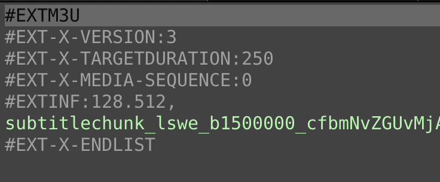

# hls-explore

A simple TUI tool to explore HLS streams.

It fetches the playlist, in text form, and renders the rows on the screen. Rows
that are expandable are green. When selecting an expandable row, and pressing
enter/return on it, that item is fetched an displayed instead.



## Installation

```
npm install -g hls-explore
```

## Usage
```
hls-explore <HLS-playlist-URL>
```


## Key-bindings

| Key | Action |
| ----| ------ |
| `j` or ⬇️     | Move cursor down |
| `k` or ⬆️     | Move cursor up |
| `Enter`      | Expand the selected item, if possible |
| `tab`        | Jump to the next expandable item |
| `shift-tab`  | Jump to the previous expandable item |
| `p`          | Exit the program and print the full URL to the selected item |
| `q` or `esc` | Close the active view, backing to the previous state |
| `Q`          | Exit |
